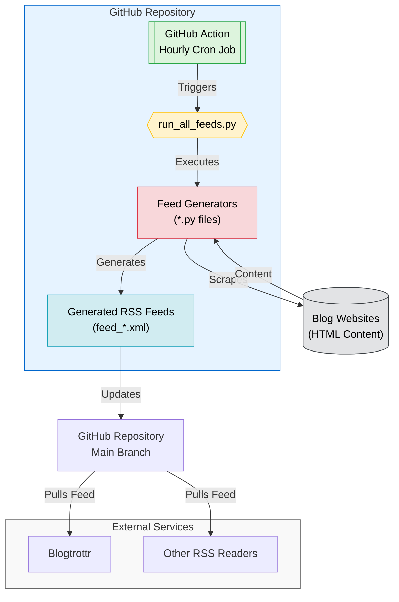

# RSS Feed Generator <!-- omit in toc -->

> [!TIP]
> This project is maintained by [@oborchers](https://github.com/oborchers) and [@Olshansk](https://github.com/Olshansk). If you gut any value out of it, consider sponsoring us on GitHub!

> [!NOTE]
> Read the blog post about this repo: [No RSS Feed? No Problem. Using Claude to automate RSS feeds.](https://olshansky.substack.com/p/no-rss-feed-no-problem-using-claude)

## tl;dr Available RSS Feeds <!-- omit in toc -->

Scraped feeds are generated hourly. "Official RSS" rows point to native feeds the blog now publishes directly.

| Blog                                                                                              | Feed                                                                                                                                 |
| ------------------------------------------------------------------------------------------------- | ------------------------------------------------------------------------------------------------------------------------------------ |
| [Anthropic Engineering](https://www.anthropic.com/engineering)                                    | [feed_anthropic_engineering.xml](https://raw.githubusercontent.com/Olshansk/rss-feeds/main/feeds/feed_anthropic_engineering.xml)     |
| [Anthropic Frontier Red Team](https://red.anthropic.com/)                                         | [feed_anthropic_red.xml](https://raw.githubusercontent.com/Olshansk/rss-feeds/main/feeds/feed_anthropic_red.xml)                     |
| [Anthropic News](https://www.anthropic.com/news)                                                  | [feed_anthropic_news.xml](https://raw.githubusercontent.com/Olshansk/rss-feeds/main/feeds/feed_anthropic_news.xml)                   |
| [Anthropic Research](https://www.anthropic.com/research)                                          | [feed_anthropic_research.xml](https://raw.githubusercontent.com/Olshansk/rss-feeds/main/feeds/feed_anthropic_research.xml)           |
| [Bits Lovers](https://www.bitslovers.com/)                                                        | [Official RSS](https://www.bitslovers.com/feed.xml)                                                                                  |
| [Claude Blog](https://claude.com/blog)                                                            | [feed_claude.xml](https://raw.githubusercontent.com/Olshansk/rss-feeds/main/feeds/feed_claude.xml)                                   |
| [Claude Code Changelog](https://code.claude.com/docs/en/changelog)                                | [Official RSS](https://code.claude.com/docs/en/changelog/rss.xml)                                                                    |
| [Cloudflare skills (commits/main)](https://github.com/cloudflare/skills)                          | [Official RSS](https://github.com/cloudflare/skills/commits/main.atom)                                                               |
| [Google DeepMind Blog](https://deepmind.google/blog/)                                             | [Official RSS](https://deepmind.google/blog/rss.xml)                                                                                 |
| [Hamel Husain's Blog](https://hamel.dev/)                                                         | [Official RSS](https://hamel.dev/index.xml)                                                                                          |
| [Interconnected (Matt Webb)](https://interconnected.org/home)                                     | [Official RSS](https://interconnected.org/home/feed)                                                                                 |
| [ITop Field News](https://itopfield.com.au)                                                       | [feed_itopfield.xml](https://raw.githubusercontent.com/Olshansk/rss-feeds/main/feeds/feed_itopfield.xml)                             |
| [Jamie Hurst's Blog](https://jamiehurst.co.uk)                                                    | [feed_jamiehurst.xml](https://raw.githubusercontent.com/Olshansk/rss-feeds/main/feeds/feed_jamiehurst.xml)                           |
| [OpenAI Engineering](https://openai.com/news/engineering/)                                        | [Official RSS](https://openai.com/news/engineering/rss.xml)                                                                          |
| [OpenAI Research](https://openai.com/news/research/)                                              | [Official RSS](https://openai.com/blog/rss.xml)                                                                                      |
| [Pulumi Blog](https://www.pulumi.com/blog/)                                                       | [feed_pulumi.xml](https://raw.githubusercontent.com/Olshansk/rss-feeds/main/feeds/feed_pulumi.xml)                                   |
| [Simon Willison's Blog (Tools)](https://simonwillison.net/)                                       | [Official RSS](https://simonwillison.net/atom/beats/tool/)                                                                           |
| [Supabase Blog](https://supabase.com/blog)                                                        | [Official RSS](https://supabase.com/rss.xml)                                                                                         |
| [Thinking Machines Lab](https://thinkingmachines.ai/blog/)                                        | [Official RSS](https://thinkingmachines.ai/blog/index.xml)                                                                           |
| [TLDR](https://tldr.tech)                                                                          | [Official RSS](https://tldr.tech/rss)                                                                                                |
| Blog                                                                     | Feed                                                                                                                             |
| ------------------------------------------------------------------------ | -------------------------------------------------------------------------------------------------------------------------------- |
| [Anthropic Engineering](https://www.anthropic.com/engineering)           | [feed_anthropic_engineering.xml](https://raw.githubusercontent.com/Olshansk/rss-feeds/main/feeds/feed_anthropic_engineering.xml) |
| [Anthropic Frontier Red Team](https://red.anthropic.com/)                | [feed_anthropic_red.xml](https://raw.githubusercontent.com/Olshansk/rss-feeds/main/feeds/feed_anthropic_red.xml)                 |
| [Anthropic News](https://www.anthropic.com/news)                         | [feed_anthropic_news.xml](https://raw.githubusercontent.com/Olshansk/rss-feeds/main/feeds/feed_anthropic_news.xml)               |
| [Anthropic Research](https://www.anthropic.com/research)                 | [feed_anthropic_research.xml](https://raw.githubusercontent.com/Olshansk/rss-feeds/main/feeds/feed_anthropic_research.xml)       |
| [Bits Lovers](https://www.bitslovers.com/)                               | [Official RSS](https://www.bitslovers.com/feed.xml)                                                                              |
| [Brettski's Blog](https://brettski.net)                                  | [feed_brettski.xml](https://raw.githubusercontent.com/Olshansk/rss-feeds/main/feeds/feed_brettski.xml)                           |
| [Claude Blog](https://claude.com/blog)                                   | [feed_claude.xml](https://raw.githubusercontent.com/Olshansk/rss-feeds/main/feeds/feed_claude.xml)                               |
| [Claude Code Changelog](https://code.claude.com/docs/en/changelog)       | [Official RSS](https://code.claude.com/docs/en/changelog/rss.xml)                                                                |
| [Cloudflare skills (commits/main)](https://github.com/cloudflare/skills) | [Official RSS](https://github.com/cloudflare/skills/commits/main.atom)                                                           |
| [Google DeepMind Blog](https://deepmind.google/blog/)                    | [Official RSS](https://deepmind.google/blog/rss.xml)                                                                             |
| [Hamel Husain's Blog](https://hamel.dev/)                                | [Official RSS](https://hamel.dev/index.xml)                                                                                      |
| [Interconnected (Matt Webb)](https://interconnected.org/home)            | [Official RSS](https://interconnected.org/home/feed)                                                                             |
| [Jamie Hurst's Blog](https://jamiehurst.co.uk)                           | [feed_jamiehurst.xml](https://raw.githubusercontent.com/Olshansk/rss-feeds/main/feeds/feed_jamiehurst.xml)                       |
| [OpenAI Engineering](https://openai.com/news/engineering/)               | [Official RSS](https://openai.com/news/engineering/rss.xml)                                                                      |
| [OpenAI Research](https://openai.com/news/research/)                     | [Official RSS](https://openai.com/blog/rss.xml)                                                                                  |
| [Pulumi Blog](https://www.pulumi.com/blog/)                              | [feed_pulumi.xml](https://raw.githubusercontent.com/Olshansk/rss-feeds/main/feeds/feed_pulumi.xml)                               |
| [Simon Willison's Blog (Tools)](https://simonwillison.net/)              | [Official RSS](https://simonwillison.net/atom/beats/tool/)                                                                       |
| [Supabase Blog](https://supabase.com/blog)                               | [Official RSS](https://supabase.com/rss.xml)                                                                                     |
| [Thinking Machines Lab](https://thinkingmachines.ai/blog/)               | [Official RSS](https://thinkingmachines.ai/blog/index.xml)                                                                       |
| [TLDR](https://tldr.tech)                                                | [Official RSS](https://tldr.tech/rss)                                                                                            |

### Planned <!-- omit in toc -->

| Blog                                                           | Status    |
| -------------------------------------------------------------- | --------- |
| [David Crawshaw](https://crawshaw.io/)                         | _planned_ |
| [Engineering.fyi](https://engineering.fyi/)                    | _planned_ |
| [Patrick Collison's Blog](https://patrickcollison.com/culture) | _planned_ |

### What is this?

You know that blog you like that doesn't have an RSS feed and might never will?

🙌 **You can use this repo to create a RSS feed for it!** 🙌

## Table of Contents <!-- omit in toc -->

- [Quick Start](#quick-start)
  - [Subscribe to a Feed](#subscribe-to-a-feed)
  - [Request a new Feed](#request-a-new-feed)
- [Create a new a Feed](#create-a-new-a-feed)
- [Star History](#star-history)
- [Ideas](#ideas)
- [How It Works](#how-it-works)
  - [For Developers 👀 only](#for-developers--only)

## Quick Start

### Subscribe to a Feed

- Go to the [feeds directory](./feeds).
- Find the feed you want to subscribe to.
- Use the **raw** link for your RSS reader. Example:

  ```text
    https://raw.githubusercontent.com/Olshansk/rss-feeds/main/feeds/feed_claude.xml
  ```

- Use your RSS reader of choice to subscribe to the feed (e.g., [Blogtrottr](https://blogtrottr.com/)).

### Request a new Feed

Want me to create a feed for you?

[Open a GitHub issue](https://github.com/Olshansk/rss-feeds/issues/new?template=request_rss_feed.md) and include the blog URL.

If I do, consider supporting my 🌟🧋 addiction by [buying me a coffee](https://buymeacoffee.com/olshansky).

## Create a new a Feed

1. Download the HTML of the blog you want to create a feed for.
2. Open Claude Code CLI
3. Tell claude to:

```bash
Use /cmd-rss-feed-generator to convert @<html_file>.html to a RSS feed for <blog_url>.
```

## Star History

[](https://star-history.com/#Olshansk/rss-feeds&Date)

## Ideas

- **X RSS Feed**: Going to `x.com/{USER}/index.xml` should give an RSS feed of the user's tweets.

## How It Works



### For Developers 👀 only

- Open source and community-driven 🙌
- Simple Python + GitHub Actions 🐍
- AI tooling for easy contributions 🤖
- Learn and contribute together 🧑‍🎓
- Streamlines the use of Claude, Claude Projects, and Claude Sync
